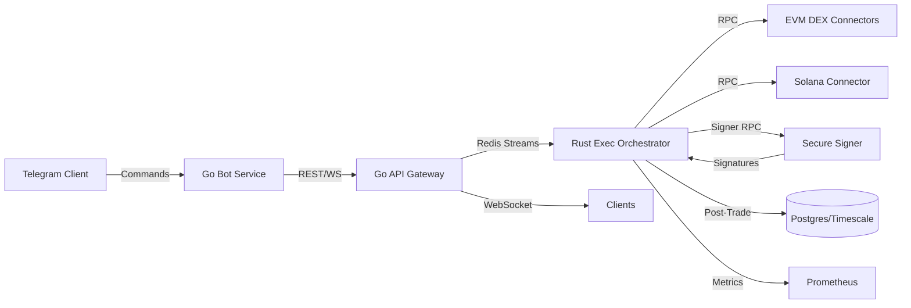

# Architecture Overview

Components are isolated by responsibility and communicate over authenticated channels. The orchestrator handles latency-sensitive operations using Rust with async runtimes while stateless Go services expose user-facing APIs.
