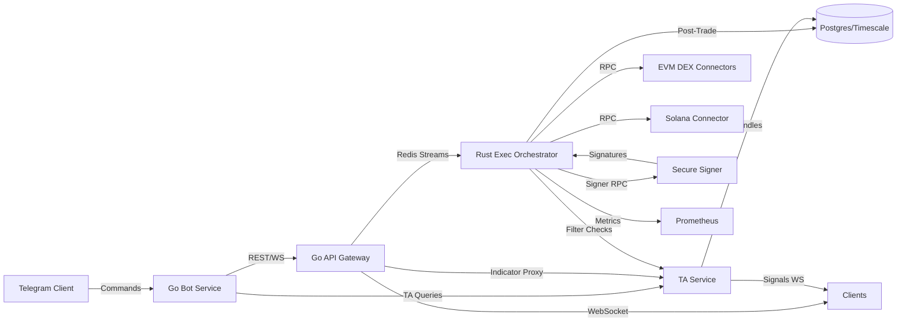

# Architecture Overview

Components are isolated by responsibility and communicate over authenticated channels. The TA service maintains Binance and Uniswap candles with Go ingestion plus Rust indicator cores, serving both bot/API queries and exec auto-trade filters. The orchestrator handles latency-sensitive operations using Rust with async runtimes while stateless Go services expose user-facing APIs.
